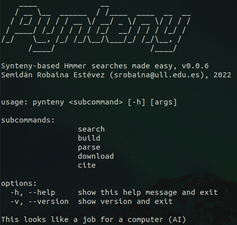

<br>

# Synteny-aware hmm searches made easy


[](https://zenodo.org/badge/latestdoi/500470783)

## :bulb: What is Pynteny?

Pynteny is Python tool to search for [synteny](https://en.wikipedia.org/wiki/Synteny) blocks in sequence data through [HMMs](https://www.bioinformatics.org/wiki/Hidden_Markov_Model) of the ORFs of interest and [HMMER](http://hmmer.janelia.org/).

Pynteny can be accessed (i) through the command line, (ii) as a Python API or (iii) as a (locally served) web application.

Get more info in the [wiki](https://github.com/Robaina/Pynteny/wiki) pages!

## :wrench: Setup

Download (or fork) repo to local directory:

```bash
git clone https://github.com/Robaina/Pynteny.git
```

cd to downloaded repo and install conda enviroment:

```bash
cd Pynteny
conda env create -f environment.yml
```

Install pynteny in conda enviroment:

```bash
conda activate pynteny
python setup.py install
```

Check that installation worked fine:

```bash
pynteny tests
```

## :rocket: Usage

Pynteny can be run either as a command line tool or as a (locally-served) web application. To run pynteny in the command line, execute:

```bash
conda activate pynteny
pynteny <subcommand> <options>
```

<p align="center">
   
</p>


There are a number of available subcommands, which can be explore in the [wiki](https://github.com/Robaina/Pynteny/wiki) pages.


Pynteny may also be used with a graphical interface (made with [Streamlit](https://streamlit.io)). The app is run on a local server in your machine, thus all files are kept locally and the app can be run without an internet connection. 

To run the app, execute the following command once pynteny has been successfully installed:

```bash
conda activate pynteny
pynteny app
```

<p align="center">
   
</p>

## :notebook_with_decorative_cover: Examples

In the [examples directory](examples/), you can find a collection of Jupyter Notebooks containing workflows to demonstrate the usate of Pynteny's command line interface as well as the Python API. We invite you to explore Pynteny's web application by executing the command `pynteny app`. Find more info in the [wiki pages](https://github.com/Robaina/Pynteny/wiki).

## :black_nib: Citation

If you use this software, please cite it as below:

Semidán Robaina Estévez. (2022). Pynteny: synteny-aware hmm searches made easy (Version 0.0.1). Zenodo. https://doi.org/10.5281/zenodo.7048685
