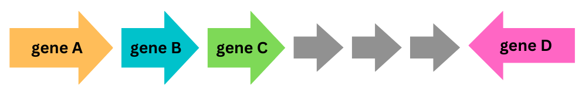

<br>

# Synteny-aware hmm searches made easy

[](https://github.com/Robaina/Pynteny/actions/workflows/tests.yml)
[](https://codecov.io/gh/Robaina/Pynteny)
[](https://github.com/Robaina/Pynteny/actions/workflows/docs.yml)

[](https://www.repostatus.org/#active)
[](https://anaconda.org/bioconda/pynteny)


[](https://anaconda.org/bioconda/pynteny)
[](https://anaconda.org/bioconda/pynteny)
[](https://GitHub.com/Robaina/Pynteny/releases/)


[](https://anaconda.org/bioconda/pynteny)

[](https://github.com/psf/black)

[](https://github.com/pyOpenSci/software-review/issues/67)
[](https://zenodo.org/badge/latestdoi/500470783)


## 1. :bulb: What is Pynteny?

`Pynteny` is Python tool to search for [synteny](https://en.wikipedia.org/wiki/Synteny) blocks in (prokaryotic) sequence data through [HMMs](https://www.bioinformatics.org/wiki/Hidden_Markov_Model) of the ORFs of interest and [HMMER](http://hmmer.janelia.org/). By leveraging genomic context information, `Pynteny` can be employed to decrease the uncertainty of functional annotation of unlabelled sequence data due to the effect of paralogs. `Pynteny` can be accessed (i) through the command line or (ii) as a Python module.

Get more info in the [documentation](https://robaina.github.io/Pynteny/) pages!

## 2. :wrench: Setup

Install with conda:

1. Pynteny requires Python 3.10. The easiest way to handle dependencies is by creating a dedicated conda environment:

```bash
conda create -n pynteny -c bioconda -c conda-forge python=3.10 pynteny
conda activate pynteny
```

2. Check that installation worked fine:

```bash
(pynteny) pynteny --help
```
### 2.1. Installing on Windows

Pynteny is designed to run on Linux machines. However, it can be installed within the [Windows Subsystem for Linux](https://learn.microsoft.com/en-us/windows/wsl/install) via conda.

### 2.2. Installing on MacOS with the latest ARM64 architecture

Pynteny doesn't currently support the latest ARM64 architecture of silicon processors (e.g. MacBook M1 and M2). If that is your case, you can install Pynteny using the workaround below (based on [this post](https://towardsdatascience.com/how-to-manage-conda-environments-on-an-apple-silicon-m1-mac-1e29cb3bad12)):

```bash
CONDA_SUBDIR=osx-64 conda create -n pynteny_x86 python=3.10
conda activate pynteny_x86
conda config --env --set subdir osx-64
conda install -c bioconda pynteny
```

## 3. :rocket: Usage

Consider the following toy example of a syntenic block:



Here, we are interested in four genes which colocate according to the pattern above: genes A-C show consecutive locations in the positive strand, followed by three (untargeted) genes and followed by gene D, which is located in the negative strand.

Pynteny can be run either as a command line tool or as a Python module. To run pynteny in the command line, execute:

```bash
conda activate pynteny
pynteny <subcommand> <options>
```

<p align="center">
   
</p>


There are a number of available subcommands, which can be explored in the [documentation](https://robaina.github.io/Pynteny/) pages.

For intance, to first download the [PGAP](https://academic.oup.com/nar/article/49/D1/D1020/6018440)'s database containing a collection of profile HMMs as well as metadata:

```bash
pynteny download --outdir data/hmms --unpack
```

Next, to build a labelled peptide database from DNA assembly data:

```bash
pynteny build \
    --data assembly.fa \
    --outfile labelled_peptides.faa

```

Finally, to search the peptide database for the syntenic structure displayed above: `>gene_A 0 >gene_B 0 >gene_C 3 <gene_D`, and using the downloaded [PGAP](https://academic.oup.com/nar/article/49/D1/D1020/6018440) database:

```bash
pynteny search \
    --synteny_struc ">gene_A 0 >gene_B 0 >gene_C 3 <gene_D" \
    --data labelled_peptides.faa \
    --outdir results/ \
    --gene_ids
```

## 4. :notebook_with_decorative_cover: Examples

Here are some Jupyter Notebooks with examples to show how Pynteny works:

<!-- <a href="https://colab.research.google.com/github/Robaina/Pynteny/blob/main/docs/examples/example_api_colab.ipynb" target="_blank"></a> -->
* [Pynteny API](https://robaina.github.io/Pynteny/examples/example_api/)
* [Pynteny CLI](https://robaina.github.io/Pynteny/examples/example_cli/)
* [Sus operon](https://robaina.github.io/Pynteny/examples/example_sus/)

You can find more notebooks in the [examples directory](docs/examples/). Find more info in the [documentation](https://robaina.github.io/Pynteny/).

## 5. :arrows_counterclockwise: Dependencies
Pynteny would not work without these awesome projects:

- [hmmer](https://github.com/EddyRivasLab/hmmer)
- [prodigal](https://github.com/hyattpd/Prodigal)
- [pyfastx](https://github.com/lmdu/pyfastx)
- [biopython](https://github.com/biopython/biopython)
- [seqkit](https://bioinf.shenwei.me/seqkit/)
- [numpy](https://github.com/numpy/numpy)
- [pandas](https://github.com/pandas-dev/pandas)
- [psutil](https://github.com/giampaolo/psutil)
- [requests](https://requests.readthedocs.io/en/latest/)
- [tqdm](https://github.com/tqdm/tqdm)

Thanks!

## 6. :octocat: Contributing

Contributions are always welcome! If you don't know where to start, you may find an interesting [issue to work in here](https://github.com/Robaina/Pynteny/issues). Please, read our [contribution guidelines](CONTRIBUTING.md) first.

## 7. :black_nib: Citation

If you use this software, please cite it as below:

Semidán Robaina Estévez. (2023). Pynteny: synteny-aware hmm searches made easy (Version 1.0.0). Zenodo. https://zenodo.org/record/7696204

