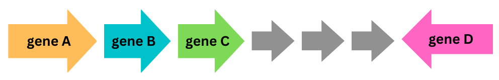

# Summary

With a growing number of available sequence data, automated function annotation of sequences has become a key subfield of Bioinformatics. In most cases, annotation methods rely on sequence similarity to peptides with known functions to assign functional labels. This approach assumes that similarity implies homology, i.e., shared ancestry. Sequence similarity is most commonly assessed by either alignment-based methods, such as BLAST [@blast], or sequence profile-based methods, such as HMMER3 [@hmmer]. In the first case, query sequences are aligned and compared to a reference sequence database. For the latter, however, query sequences are compared to a profile Hidden Markov Model (HMM), a probabilistic model of the sequence space which is obtained from a collection of representative sequences with the same annotated function. Therefore, profile-based methods are particularly well-suited when query sequences are not sufficiently represented in reference databases, as it facilitates the search of distant homologs due to the sequence variability encoded in the profile HMM [@hmms-a;@hmms-b].

While function is generally conserved among sequence orthologs, i.e., homologs that are the result of a speciation event, this is not the general case of paralogs, that is, homologs that are the result of a gene duplication event, which typically undergo functional diversification. Due to the existence of paralogs, it is impossible to assess orthology solely based on sequence similarity, and additional sources of information, such as phylogenetics and genomic context are necessary to resolve paralogous from orthologous sequences. The consideration of genomic context, such as _synteny_&mdash;the physical co-location of genes within the same chromosome across different species&mdash;during function annotation is particularly useful in prokaryotes, where genes tend to cluster together into operons and gene organizations above operons. In these cases, syntenic information can reduce annotation uncertainty by providing additional, co-localization constraints to the homology search. Therefore, constraining profile-based searches with syntenic information could markedly benefit annotation pipelines of prokaryotic sequences, particularly those originating in metagenomic samples, which typically are poorly represented in reference databases.

# Statement of need

Here we introduce `Pynteny`, a Python tool designed to conduct synteny-aware, profile HMM searches in prokaryotic sequence databases. `Pynteny` facilitates querying sequence databases with arrangements of profile HMMs that reflect a target syntenic block. To this end, it enables encoding positional information, such as gene order, maximum in-between gene distances, and strand specificity, into the search query. 

For instance, consider the following syntenic block:

{ width=70% }

The syntenic block shown above is composed of four genes, `A`, `B`, `C`, and `D`. Genes A-C locate consecutively in the positive strand and are followed by three untargeted genes and by gene D, which is located in the negative strand. `Pynteny` allows searching for the syntenic block above with the following query string:

$>HMM_A \:\: 0 \:\: >(HMM_{B1} | HMM_{B2}) \:\: 0 \:\: >HMM_C \:\: 3 \:\:< HMM_D,$

where $HMM_A$ represents the name of the HMM modeling gene A, each integer represents the maximum number of untargeted genes between consecutive HMMs, and `<` and `>` indicate the strand in which to search for the HMM pattern, antisense and sense, respectively. Alternative HMMs can be used for a single gene, as shown in the HMM group $(HMM_{B1} | HMM_{B2})$ above, in which case the search will be performed with both HMMs. Additionally, gene symbols can be used directly in the query string when the PGAP HMM database [@pgap] is employed, which is the default database used by `Pynteny`.

`Pynteny` was designed to be used by researchers working with large, unannotated sequence databases, such as those typically encountered in metagenomic analyses. It can be accessed through a command line interface or easily integrated into pipelines as a Python package. It can directly handle assembled nucleotide sequence data, however, it also accepts annotated genomes in GenBank format as input data. In both cases, the package provides all the necessary functionality to preprocess the sequence database. 

`Pynteny` relies on Prodigal [@prodigal] to translate and add positional tags to individual genes, and on HMMER3, [@hmmer] to search sequence databases for homologs through profile HMMs. Usage information as well as examples in the form of Jupyter Notebooks for both the command line interface and the Python package are available in the [documentation](https://robaina.github.io/Pynteny/).

# State of the field

Several existing tools are dedicated to the exploration, analysis, and visualization of synteny blocks among genomes. In these tools, users typically input several annotated genomes and obtain a collection of syntenic relations of shared gene sets among the genomes. Examples of these tools are MCScan [@mcscan] and MCScanX [@mcscanx], Clinker [@clinker], pyGenomeViz [@pyGenomeViz], genePlotR [@geneplotR], gggenomes [@gggenomes], GENESPACE [@genespace] and Mology [@mology]. These tools are excellent resources for the identification and analysis of syntenic relations among genomes, and they are functionally complementary to `Pynteny`. Specifically, rather than exploring syntenic blocks within annotated genomes, `Pynteny`'s objective is to search for specific syntenic structures within unannotated (assembled) sequence data, as well as to leverage syntenic information to reduce uncertainty due to paralogs during function annotation. Therefore, `Pynteny` requires a previous identification of conserved syntenic structures, which can be obtained from existing tools such as the ones previously indicated.

# Availability
`Pynteny` is available as a Python package for Linux and MacOS under the [Apache 2.0](https://www.apache.org/licenses/LICENSE-2.0) license and hosted on [bioconda](https://anaconda.org/bioconda/pynteny), a [Docker image](https://github.com/Robaina/Pynteny/pkgs/container/pynteny) is also available. Source code can be found on [GitHub](https://github.com/Robaina/Pynteny), and features a GitHub CodeSpace environment and a Continuous Integration workflow to run integration tests on changes. Documentation is hosted on [GitHub pages](https://robaina.github.io/Pynteny/) and is built for each new release.

# Acknowledgements

We acknowledge constructive feedback from Pynteny users as well as editors and reviewers Alex Batisse, C. Thoben, David Nicholson, Ariane Sasso, and Leah Wasser at PyOpenSci who have tremendously helped to improve the package. This study was funded by project PID2019-110011RB-C32 (Spanish Ministry of Science and Innovation, Spanish State Research Agency, doi: 10.13039/501100011033).

# References